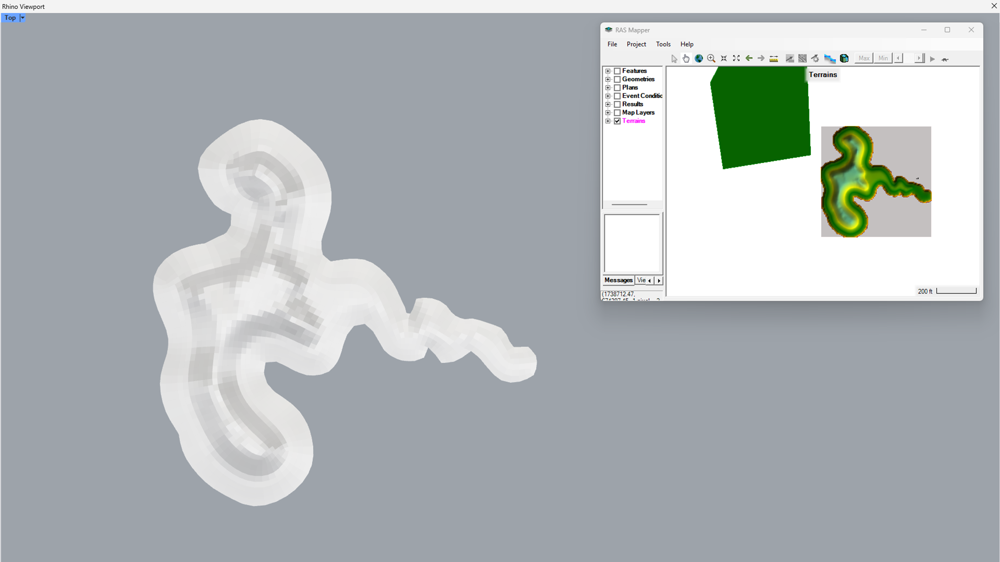
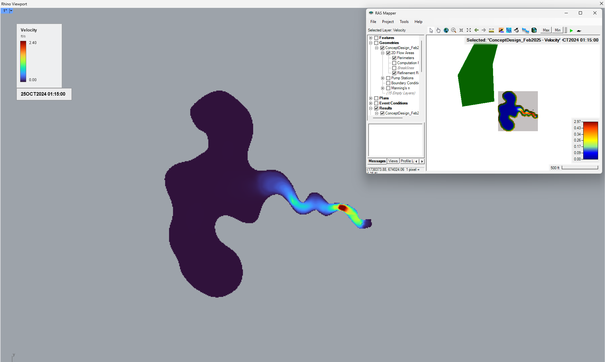
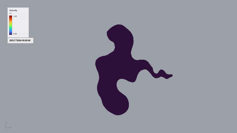
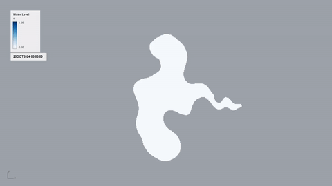
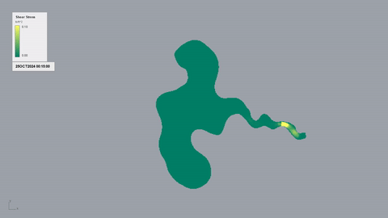
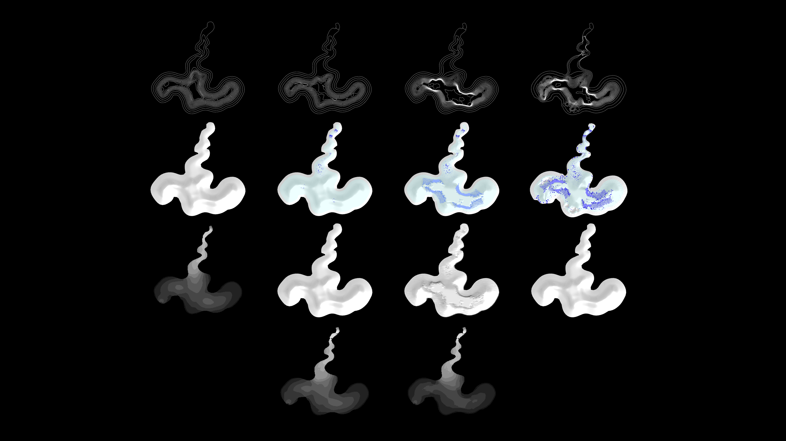

# DINOFISH

DINOFISH is a Rhino/Grasshopper plugin for working between HEC-RAS and Rhino/Grasshopper. It is primarily developed and maintained by [Yuxin Yang](https://www.linkedin.com/in/yuxin-yang-gisp-78a671191/).

DINOFISH helps users move terrain and geomorphic edits from Rhino/Grasshopper into HEC-RAS, and bring hydraulic simulation results from HEC-RAS back into Rhino/Grasshopper with lower friction.

**Source Code**:

With DINOFISH, users can:

1. **Prepare terrain for HEC-RAS**

    Users can create 2.5D mesh surfaces in Rhino/Grasshopper and export them as `.tif` files for HEC-RAS terrain input. The 2.5D mesh surfaces work similar to a drape effect, and can help encapsulate both terrain and geomorphic edits.

    

2. **Read HEC-RAS results in Rhino/Grasshopper**

    Users can import HEC-RAS HDF5 files and visualize results for HEC-RAS 2D Flow Areas as colored meshes in Rhino/Grasshopper. The current parser supports velocity, shear stress, water level, and water depth, with a timestamp controller for viewing results over time.

    

<table>
  <tr>
    <td width="33%"></td>
    <td width="33%"></td>
    <td width="34%"></td>
  </tr>
  <tr>
    <td align="center">Velocity</td>
    <td align="center">Water level</td>
    <td align="center">Shear stress</td>
  </tr>
</table>

3. **Incorporate CFD into design iterations with ease**

    

## References

Few plugins bring CFD or hydraulic simulation workflows into Rhino/Grasshopper. [Crayfish](https://www.lutraconsulting.co.uk/projects/crayfish) inspired this project by showing how simulation results can be read as mesh data in QGIS. [FluX](https://github.com/xunliuDesign/FluX) was also an inspiration for connecting CFD workflows with design.
